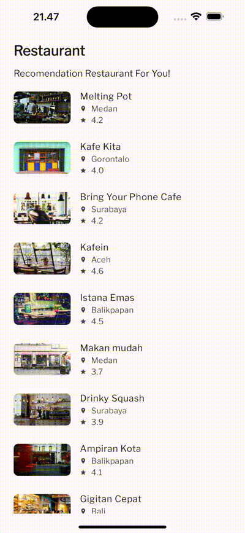

# restaurant_app

A starter project.

```markdown
# Restaurant App

A Flutter project for a restaurant application.

## Project Structure

.
├── lib
│   ├── detail
│   │   └── detail_restaurant.dart
│   ├── home
│   │   └── list_restaurant.dart
│   ├── model
│   │   └── restaurant.dart
│   ├── splash_screen
│   │   └── splash_screen.dart
│   └── helpers
│       └── styles.dart
├── android
├── assets
│   └── local_restaurant.json
├── ios
├── test
├── web
├── pubspec.yaml

```
- `lib/`: Contains the main Dart code for your Flutter project.
  - `detail/`: Dart file for the detail screen (`detail_restaurant.dart`).
  - `home/`: Dart file for the home screen (`list_restaurant.dart`).
  - `model/`: Dart file defining the `Restaurant` model.
  - `splash_screen/`: Dart file for the splash screen (`splash_screen.dart`).
  - `helpers/`: Helper files, such as styles (`styles.dart`).
- `android/`: Android-specific files.
- `assets/`: Contains assets used by the application, such as `local_restaurant.json`.
- `ios/`: iOS-specific files.
- `test/`: Folder for your Flutter tests.
- `web/`: Folder for web-specific code and assets.
- `pubspec.yaml`: Configuration file for your Flutter project.
```
```

Data structure
```json
{
  "restaurants": [
    {
      "id": "rqdv5juczeskfw1e867",
      "name": "Melting Pot",
      "description": "Lorem ipsum dolor sit amet, consectetuer adipiscing elit. Aenean commodo ligula eget dolor. Aenean massa. Cum sociis natoque penatibus et magnis dis parturient montes, nascetur ridiculus mus. Donec quam felis, ultricies nec, pellentesque eu, pretium quis, sem. Nulla consequat massa quis enim. Donec pede justo, fringilla vel, aliquet nec, vulputate eget, arcu. In enim justo, rhoncus ut, imperdiet a, venenatis vitae, justo. Nullam dictum felis eu pede mollis pretium. Integer tincidunt. Cras dapibus. Vivamus elementum semper nisi. Aenean vulputate eleifend tellus. Aenean leo ligula, porttitor eu, consequat vitae, eleifend ac, enim. Aliquam lorem ante, dapibus in, viverra quis, feugiat a, tellus. Phasellus viverra nulla ut metus varius laoreet.",
      "pictureId": "https://restaurant-api.dicoding.dev/images/medium/14",
      "city": "Medan",
      "rating": 4.2,
      "menus": {
        "foods": [
          {
            "name": "Paket rosemary"
          },
          {
            "name": "Toastie salmon"
          },
          {
            "name": "Bebek crepes"
          },
          {
            "name": "Salad lengkeng"
          }
        ],
        "drinks": [
          {
            "name": "Es krim"
          },
          {
            "name": "Sirup"
          },
          {
            "name": "Jus apel"
          },
          {
            "name": "Jus jeruk"
          },
          {
            "name": "Coklat panas"
          },
          {
            "name": "Air"
          },
          {
            "name": "Es kopi"
          },
          {
            "name": "Jus alpukat"
          },
          {
            "name": "Jus mangga"
          },
          {
            "name": "Teh manis"
          },
          {
            "name": "Kopi espresso"
          },
          {
            "name": "Minuman soda"
          },
          {
            "name": "Jus tomat"
          }
        ]
      }
    },
    //Other data 
  ]
}
```

## Getting Started

Codelab study jam

Todo 1
```dart
return Expanded(
  child: ListView.builder(
    itemCount: restaurants.length,
    itemBuilder: (context, index) {
      return _buildRestaurantItem(context, restaurants[index]);
    },
  ),
);
```
Todo 2
```dart
Widget _buildRestaurantItem(BuildContext context, Restaurant restaurant) {
    return Padding(
      padding: const EdgeInsets.only(top: 8.0, left: 8.0, right: 8.0),
      child: ListTile(
        leading: buildHeroImage(restaurant),
        title: Text(
          restaurant.name,
          style: const TextStyle(fontWeight: FontWeight.w200),
        ),
        subtitle: Column(
          crossAxisAlignment: CrossAxisAlignment.start,
          children: [
            _buildIconName(restaurant.city, Icons.place),
            _buildIconName('${restaurant.rating}', Icons.star),
          ],
        ),
        onTap: () {
          // Navigasi ke halaman detail ketika item restoran ditekan.
          Navigator.pushNamed(context, DetailRestaurant.routeName,
              arguments: restaurant);
        },
      ),
    );
  }
```
Todo 3
```dart
 Row _buildIconName(String name, IconData icon) {
    return Row(
      children: [
        Icon(
          icon,
          size: 12,
        ),
        const SizedBox(
          width: 8,
        ),
        Text(name),
      ],
    );
  }
```
Todo 4
```dart
  Hero buildHeroImage(Restaurant restaurant) {
    return Hero(
        tag: restaurant.pictureId,
        child: SizedBox(
          width: 100,
          height: 100,
          child: ClipRRect(
            borderRadius: BorderRadius.circular(8),
            child: _buildImage(restaurant.pictureId),
          ),
        ));
  }

  Widget _buildImage(String imageUrl) {
    return Image.network(
      imageUrl,
      fit: BoxFit.fill,
      errorBuilder: (ctx, error, _) => const Center(child: Icon(Icons.error)),
    );
  }
```

Final result




A few resources to get you started if this is your first Flutter project:

- [Lab: Write your first Flutter app](https://docs.flutter.dev/get-started/codelab)
- [Cookbook: Useful Flutter samples](https://docs.flutter.dev/cookbook)

For help getting started with Flutter development, view the
[online documentation](https://docs.flutter.dev/), which offers tutorials,
samples, guidance on mobile development, and a full API reference.
